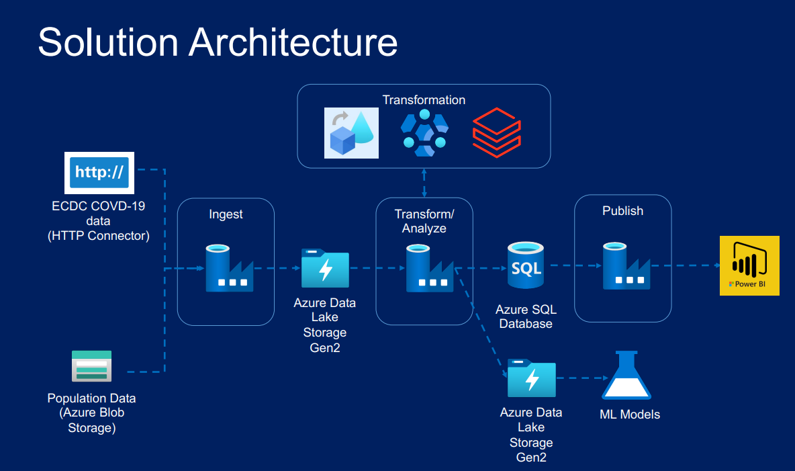
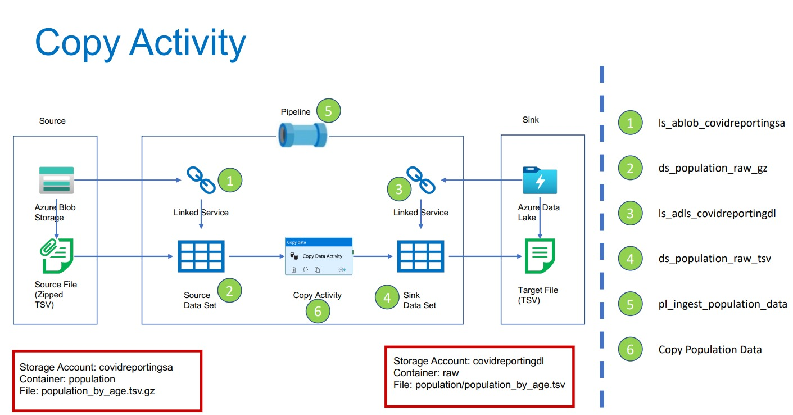

# 🦠 COVID-19 Data Pipeline with Azure Data Factory

first of all this git repo is an implementation for the course : [ azure_data_factroy_course ](https://www.udemy.com/course/learn-azure-data-factory-from-scratch/learn)

Welcome to the COVID-19 Reporting Pipeline — a cloud-based data engineering project focused on analyzing the pandemic’s impact across Europe during 2020. This journey began with a simple but powerful goal: to collect, clean, transform, and analyze COVID-19 data in a way that could empower decision-makers and data scientists alike.

## 💡 The Idea

Imagine you're part of an analytics team that needs to understand how COVID-19 spread across different European countries — not just infections, but hospital admissions, ICU loads, and even testing behavior. The data exists, scattered across public health sources like the ECDC and internal repositories like Azure Blob Storage. But the real challenge? Turning it into something useful.

That’s where Azure Data Factory (ADF) comes in. The pipeline we’ve built uses ADF to orchestrate data ingestion from the ECDC and Blob Storage, run transformations using both ADF Data Flows and Databricks, and ultimately load everything into Azure SQL Database for reporting.

## 🧩 The Pipeline in Action

The process starts with data ingestion. Four datasets are pulled from different locations: confirmed cases and deaths, hospital admissions, testing data, and population statistics. ADF Pipelines handle these transfers using activities like `Copy`, `Get Metadata`, and `Validation`. While the population data sits in Blob Storage, the rest are downloaded from ECDC's site.

Once in the lake, transformation begins. The pipeline branches out into two main processing paths: one for the cases and deaths data, and another for hospital admission stats. Each flow is thoughtfully designed — filters narrow it down to European countries, pivot operations restructure the data, and lookups enrich it with metadata like country codes.

Meanwhile, the population data goes through a separate transformation — this time using a Databricks notebook. This step ensures that demographic attributes, like age distribution, are ready to support future use cases like machine learning models for predicting mortality.

With the data now clean and structured, it’s time to centralize it. ADF takes the transformed datasets and moves them into Azure SQL Database. From there, Power BI connects directly, pulling fresh, queryable data into sleek visualizations. Analysts can now track trends over time — spotting peaks in infections, changes in hospitalization rates, and correlations between population structure and health outcomes.

## 🖥️ The Environment Behind It

To make all this happen, several Azure services were brought together:

- Azure Data Factory orchestrates the entire workflow.
- Azure Data Lake Gen2 serves as the landing and staging zone.
- Azure Blob Storage holds internal datasets.
- Azure SQL Database stores the final, queryable data.
- Azure Databricks handles complex data wrangling.
- And finally, Power BI turns raw numbers into insights.

